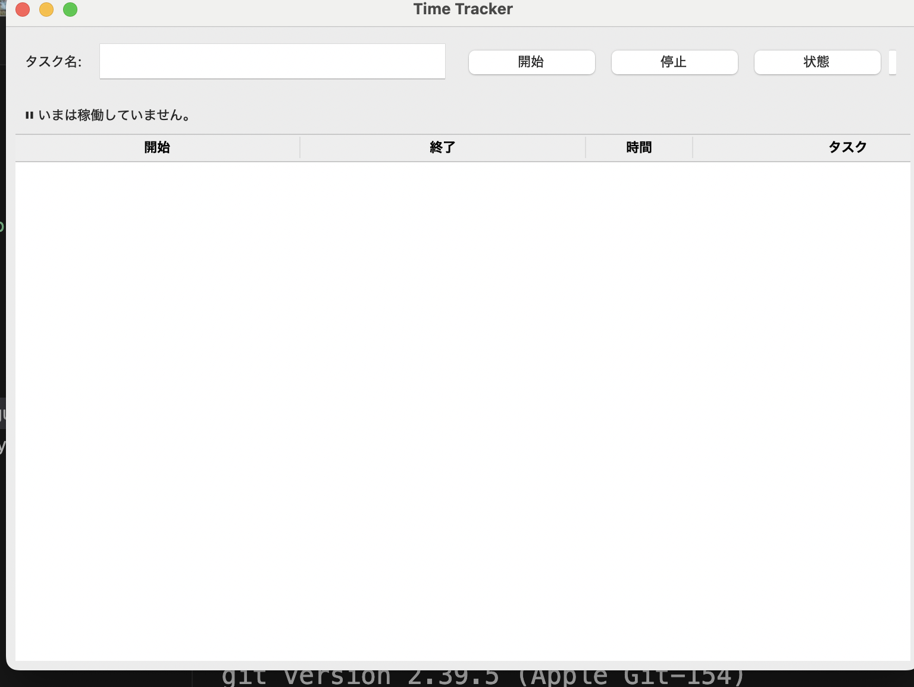

# ⏱ Time Tracker

Pythonで作成した作業時間記録アプリです。  
CLI（コマンドライン）とGUI（Tkinter）どちらでも操作できます。  

---

## 📸 GUI画面


---

## 🚀 機能
- 作業開始 / 停止 / 状態確認
- 作業履歴を表示
- CSV出力（Excel集計用）
- GUIで直感的に操作可能

---

## 🛠 使用技術
- Python 3.13
- Tkinter（GUI）
- JSON保存 / CSV出力

---

## ▶️ 使い方

### インストール
```bash
git clone https://github.com/motohiro-murai/time-tracker.git
cd time-tracker

# 作業開始
python time_tracker.py start 勉強

# 状態確認
python time_tracker.py status

# 作業停止
python time_tracker.py stop

# 履歴確認（末尾から5件）
python time_tracker.py log --limit 5

# CSV出力
python time_tracker.py csv --out data/log.csv --with-hours


---

### 3. 保存してプレビュー確認
- VS Codeなら右上の「プレビュー」ボタンで見た目確認できます。  
- GitHubにPushすると、画像付きでバッチリ見えます。

---

### 4. Pushで反映
```bash
git add README.md
git commit -m "READMEを整理して完成版に更新"
git push origin main